# 🚀 Desafio Fullstack (Java/React)

por: `Rafael Ramos dos Santos` 💙

## ✅ 1. Visão Geral do projeto

Com base nos requisitos exigidos como:

- Criação de pautas
- Votar em uma pauta SIM/NAO
- Exibir resultados de uma pauta
- Não permitir que cooperados votem mais de uma vez em uma pauta
- Dentro outros...

Foi desenvolvido o `frontend` e `backend` de um sistema de votação de cooperativa.

### 🎨 Resultado - Frontend (prévia)


➡️ Disponível em: [link](#)

### ⚙️ Resultado - Backend (prévia)

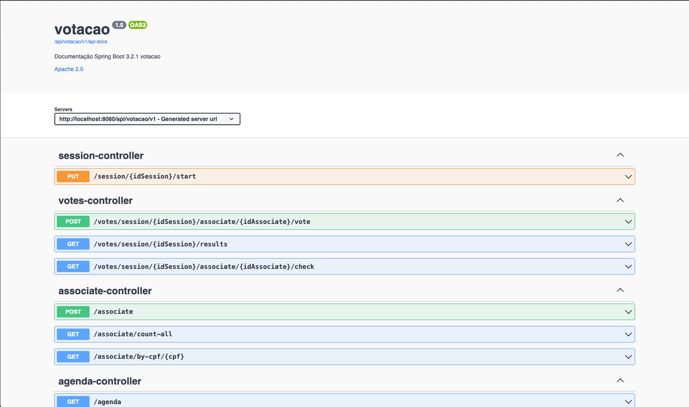

➡️ Disponível em: [link](#)

## 2. ⚒️ Tecnologias Utilizadas

### Frontend

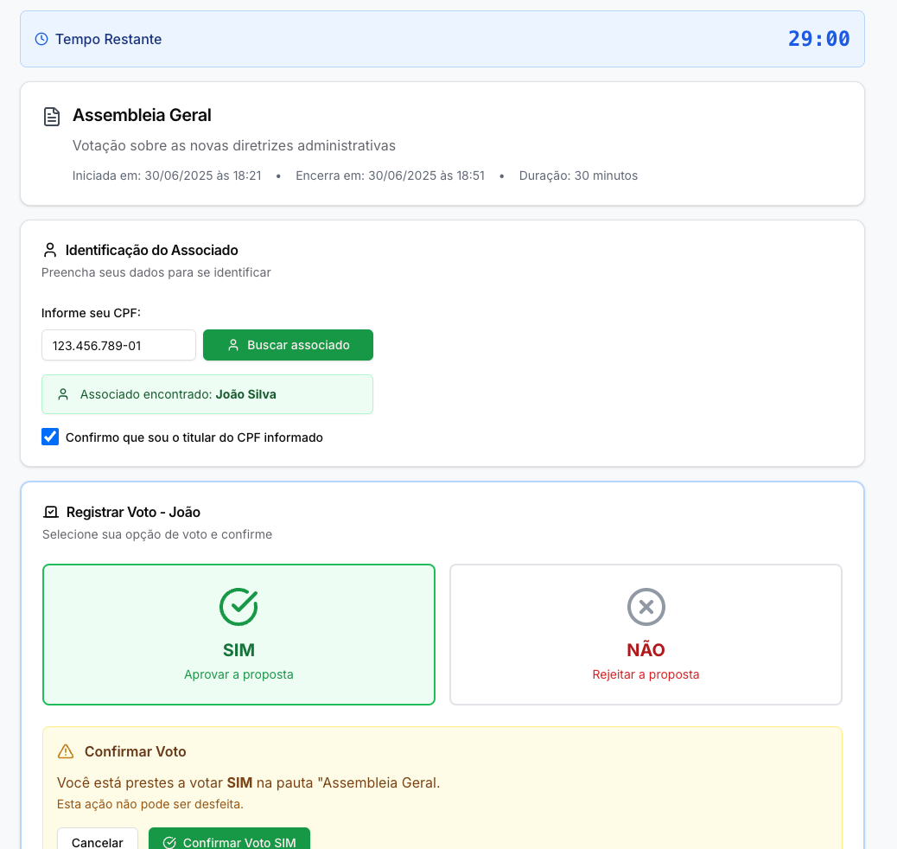

<p align="center">Prévia - Tela de votação</p>

- **Framework lib principal:** `React` + `Nextjs` + `Typescript`: Uma stack muito boa de se utilizar com ótima DX (developer experience), a componentização torna o processo muito mais ágil, deixou o projeto mais escalável com as tipagens do typescript, além de tornar o processo de manipulação do DOM para adicionar "reatividade" muito mais facilitado.

- **Recursos de estilização principais** `Tailwindcss` + `ShadcnUI`: O Tailwind facilita muito na estilização com as suas diversas classes utilitárias, além de não precisar ficar criando diversos arquivos de estilização. Já o Shadcn traz componentes prontos e já validados através do RadixUi com uma estilização bem refinada e fácil de customizar por ter acesso ao código-fonte do componente.

- **Formulários e Validação** `React Hook Form` + `Zod`: O React Hook form facilita muito todo o processo de capturar dados de elementos HTML, gerenciar estados de formulário, disparar eventos de submit, lidar com Controlled e Uncontrolled inputs e por aí vai. Já o Zod possibilita criar schemas de validação com mensagens customizada de forma bem ágil, além de ter integração com o React Hook Form.

- **Client http, API e Caching** `Tanstack-query (react-query)` + `Axios`: O Tanstack query facilita muito lidar com requisições HTTP com Queries e Mutations. Ele traz diversas funcionalidades como: Controle do estado da requisição, caching, reFetching, revalidar cache lidar com sucesso e erro da requisição, dentre outros. Já o Axios traz uma interface bem fácil e intuitiva de utilizar e configurar para montar requisições HTTP.

- **Formatação de Código** `Prettier` + `Eslint` + `plugin-tailwind`: O prettier já é muito utilizado na comunidade pela sua excelente formatação, sempre utilizo nos meus projetos. O Eslint já vem por padrão no projeto Next e sempre tenho o costume de rodar o `npm run lint` para verificar o código antes de subir para o Github. Quando utilizo tailwind, gosto de usar um plugin que organização a posição das classes, deixando mais organizado e legível.

- **Outros recursos de estilização e Experiência do usuário**:

  - `Sonner:` Toast com um design minimalista para exibir feedbacks de estados para o usuário.
  - `@react-input/mask:` Utilizei para aplicar uma máscara no campo de `cpf` facilitou bastante a integração com a estiliação do Shadcn.

- **Fonte de inspiração da interface** `V0.dev`: Compilei tudo que eu precisava fazer no projeto e busquei inspiração na IA da V0.dev da Vercel. Com isso, tive muitos insights de como eu poderia montar a interface e isso já me ajudou a pensar inclusive em algumas regras de negócio.

### Backend

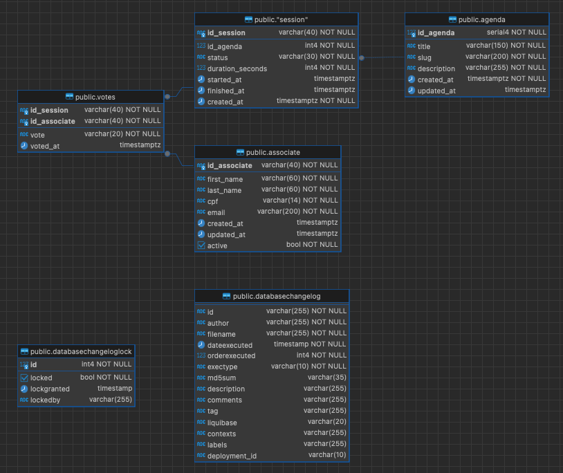

<p align="center">Diagrama ER - Banco de dados. Extraído via Dbeaver</p>

> As colunas `databasechangelog` e `databasechangeloglock` são geradas automaticamente pelo Liquibase para versionamento do banco.

- **Stack Principal:** `Java` `Spring Boot - 3.2.1`: O Spring traz com ele um ecossistema muito bom de ferramenta para usar desde a parte WEB até o Spring Data, Security e outras... É excelente e tem padrões de projeto muito bem definidos pela comunidade.

- **Banco de Dados e Migrations:** `PostgreSQL` e `Liquibase`: É um DBMS que já tenho familiaridade com algumas particularidades de escrita de SQL e do próprio banco. É fácil de encontrar recursos para publicar em produção. Tenho familiaridade com o Liquibase e acho bem tranquilo e organizado para criar as migrations que serão persistidas e monitoradas no banco.

- **Documentação** `Open API Swagger`: O Swagger é excelente para usar como documentação da API, tem diversas annotations para documentar melhor os endpoints (para além da documentação gerada automaticamente).

## 3. ✏️ Como utilizar o Projeto

### Backend

Requisitos necessários:

- Ter o Java versão mínima `>=17`
- Maven 3.6.3+
- Imagem PostgreSQL (Caso rodar banco local)

Passo-apasso para utilizar o projeto

```bash
# Clone o repositório
git clone https://github.com/RafaelR4mos/desafio-votacao-fullstack.git

# Entre na pasta frontend
cd backend

# Instale as dependências
./mvnw clean install

# Crie o arquivo .env e adicione a linha abaixo
./mvnw spring-boot:run

# Abra o navegador e acesse a documentação
http://localhost:8080/api/votacao/v1/swagger-ui/index.html#
```

### Frontend

Requisitos necessários:

- Ter o Node versão mínima `>=18.17.0`

Passo-apasso para utilizar o projeto

```bash
# Clone o repositório
git clone https://github.com/RafaelR4mos/desafio-votacao-fullstack.git

# Entre na pasta frontend
cd frontend

# Instale as dependências
npm install

# Crie o arquivo .env e adicione a linha abaixo
+ NEXT_PUBLIC_BACKEND_URL=url-remota
OU
+ NEXT_PUBLIC_BACKEND_URL=http://localhost:8080/api/votacao/v1 #API local

# Rode o projeto
npm run dev

# Abra o navegador e acesse
http://localhost:3000
```

## 💡 4. Pontos fortes da entrega (na minha opinião)

1. Tratamento de exceções:
   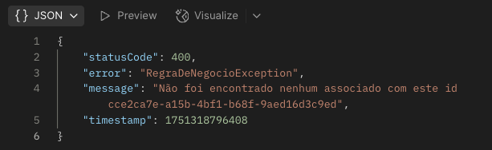

   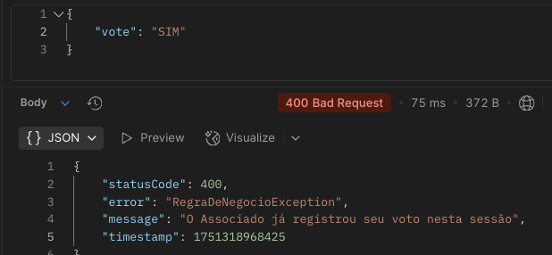

   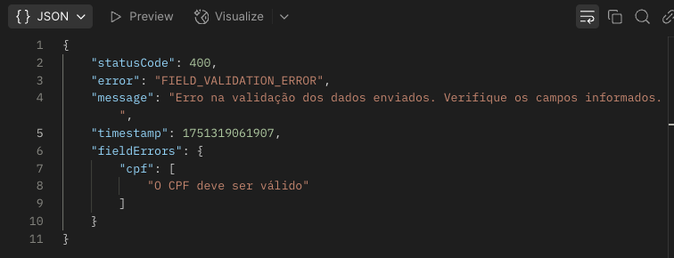

2. Responsividade:

   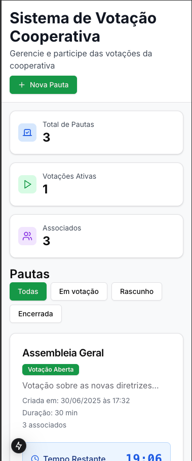
   
   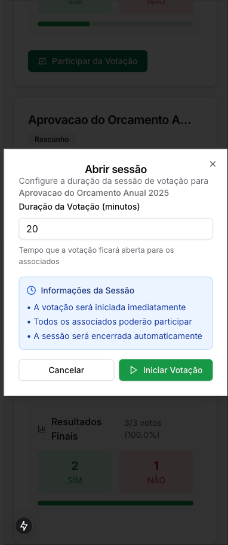

3. Feedbacks visuais:

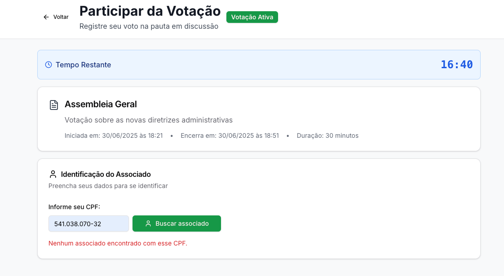
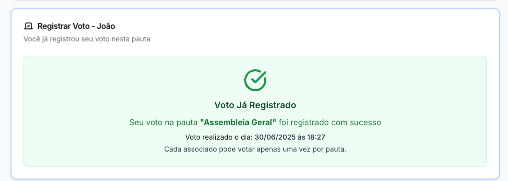
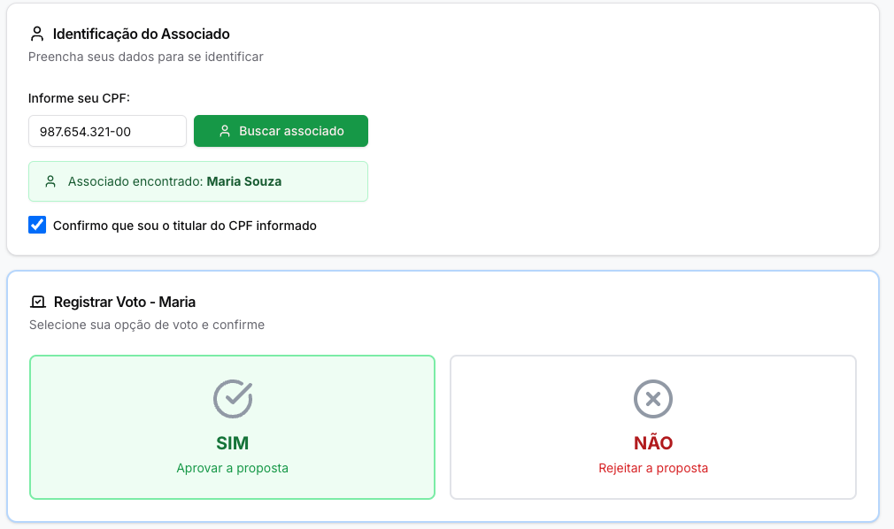


Estes são alguns dos pontos em que eu acredito que fiz um bom trabalho. Tem muita margem para melhoria ainda, e eu adoraria receber feedbacks sobre. Espero que tenha gostado 😄

---

por [Rafael Ramos](https://www.linkedin.com/in/rafaelr4mos/) 💙
